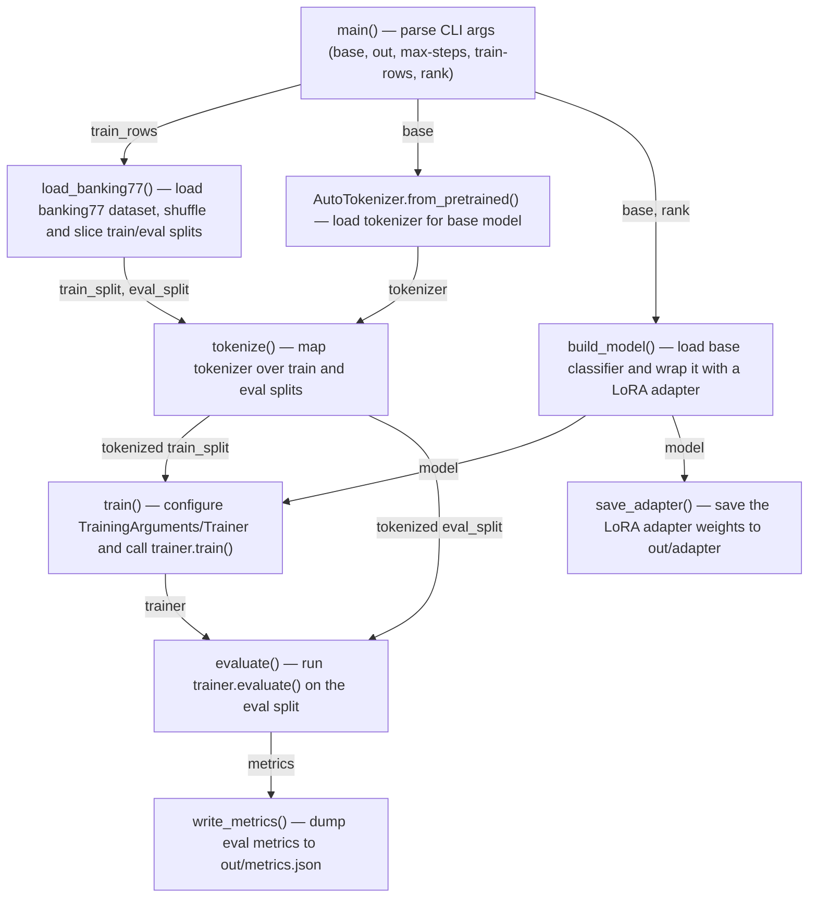

Run: `python train_lora.py --base <hf model id> --out runs/lora` — starts at `main()` in `repo/train_lora.py`, executed via the `if __name__ == "__main__"` guard.

| box id | label | where it lives | what it does |
|---|---|---|---|
| A | main() — parse CLI args | repo/train_lora.py:53-60 | Parses --base, --out, --max-steps, --train-rows, --rank and drives the whole pipeline. |
| B | load_banking77() — load and slice dataset | repo/train_lora.py:15-17 | Loads mteb/banking77, shuffles train split, selects train_rows train examples and train_rows/4 eval examples. |
| C | AutoTokenizer.from_pretrained() — load tokenizer | repo/train_lora.py:63 | Loads the tokenizer matching the chosen base model. |
| D | tokenize() — tokenize splits | repo/train_lora.py:20-21 | Maps the tokenizer over a dataset split with truncation and max_length=64. |
| E | build_model() — build LoRA model | repo/train_lora.py:24-28 | Loads the base sequence-classification model and wraps it in a PEFT LoRA adapter targeting query/value modules. |
| F | train() — run Trainer | repo/train_lora.py:31-37 | Builds TrainingArguments and a Trainer, then calls trainer.train() on the tokenized train split. |
| G | evaluate() — run eval | repo/train_lora.py:40-41 | Calls trainer.evaluate() on the tokenized eval split. |
| H | save_adapter() — save weights | repo/train_lora.py:44-45 | Saves the LoRA adapter to out/adapter via model.save_pretrained(). |
| I | write_metrics() — write metrics.json | repo/train_lora.py:48-50 | Serializes the eval metrics dict to out/metrics.json. |

## Other entry points
- No other entry points exist in the repository; `repo/train_lora.py` is the only file and `main()` is the sole runnable path.
