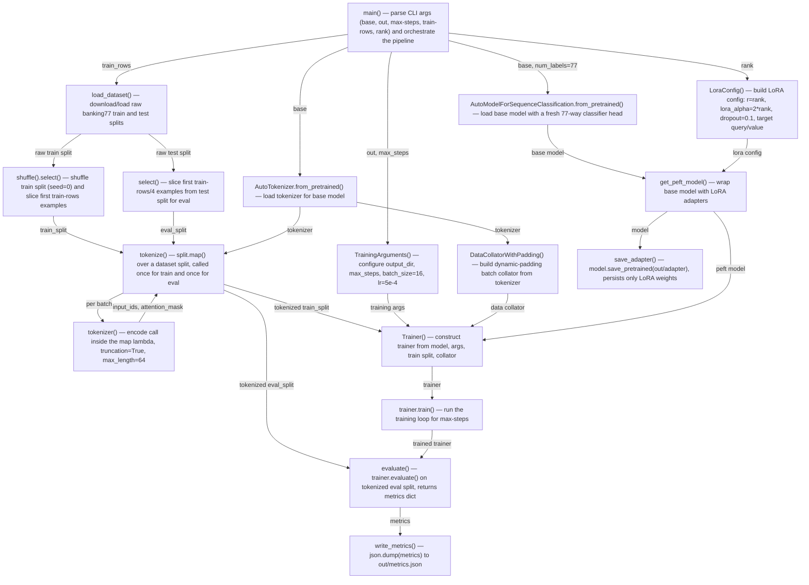

Run: `python train_lora.py --base <hf model id> --out runs/lora` — starts at `main()` in `repo/train_lora.py`, executed via the `if __name__ == "__main__"` guard.

| box id | label | where it lives | what it does |
|---|---|---|---|
| A | main() — parse CLI args and orchestrate | repo/train_lora.py:53-69 | Parses --base, --out, --max-steps, --train-rows, --rank via argparse, then calls the pipeline functions in sequence. |
| B | load_dataset() — load raw banking77 | repo/train_lora.py:16 | Downloads/loads the mteb/banking77 dataset, producing raw train and test splits. |
| C | shuffle().select() — slice train split | repo/train_lora.py:17 | Shuffles the raw train split with seed=0 and selects the first train-rows examples. |
| D | select() — slice eval split | repo/train_lora.py:17 | Selects the first train-rows/4 examples from the raw test split to use as the eval split. |
| E | AutoTokenizer.from_pretrained() — load tokenizer | repo/train_lora.py:63 | Loads the tokenizer matching the chosen base model. |
| F | tokenize() — map over dataset split | repo/train_lora.py:20-21 | Calls split.map() to apply the tokenizer to every example in a split; invoked once for train and once for eval. |
| G | tokenizer() — encode call | repo/train_lora.py:21 | The lambda's call to the tokenizer on batch text, with truncation=True and max_length=64. |
| H1 | AutoModelForSequenceClassification.from_pretrained() — load base model | repo/train_lora.py:25 | Loads the base model with a freshly initialized 77-way sequence-classification head. |
| H2 | LoraConfig() — build LoRA config | repo/train_lora.py:26-27 | Constructs the LoRA configuration: task type SEQ_CLS, rank r, lora_alpha=2*r, dropout=0.1, targeting query/value modules. |
| H3 | get_peft_model() — wrap with LoRA | repo/train_lora.py:28 | Wraps the base model with LoRA adapters per the config, returning the trainable PEFT model. |
| I1 | TrainingArguments() — configure training | repo/train_lora.py:32-33 | Builds training args: output_dir=out, max_steps, per_device_train_batch_size=16, learning_rate=5e-4, logging_steps=1, save_strategy="no". |
| I2 | DataCollatorWithPadding() — build collator | repo/train_lora.py:35 | Builds a dynamic-padding batch collator from the tokenizer. |
| I3 | Trainer() — construct trainer | repo/train_lora.py:34-35 | Constructs the HF Trainer from the model, training args, tokenized train split, and data collator. |
| I4 | trainer.train() — run training loop | repo/train_lora.py:36 | Runs the training loop for max-steps and returns the trainer. |
| J | evaluate() — run eval | repo/train_lora.py:40-41 | Calls trainer.evaluate() on the tokenized eval split and returns the metrics dict. |
| K | save_adapter() — save LoRA weights | repo/train_lora.py:44-45 | Saves only the LoRA adapter weights to out/adapter via model.save_pretrained(). |
| L | write_metrics() — write metrics.json | repo/train_lora.py:48-50 | Serializes the eval metrics dict to out/metrics.json. |
</content>
