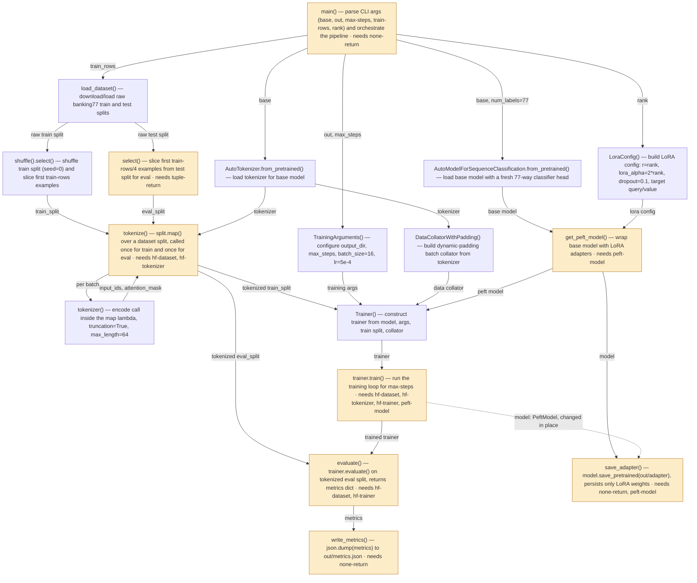

# CFG + data flow

*8 functions boxed, 9 computations, 2 components; 0 hand-offs unknown, 2 cross-checks to review.*

Path (from L1): `python train_lora.py --base <hf model id> --out runs/lora` — starts at `main()` in `repo/train_lora.py`, executed via the `if __name__ == "__main__"` guard.

Types: pyright 1.1.414 and the catalogue; environment: the project's virtualenv (transformers, peft, datasets installed). Nothing was run.

## Annotated L2 diagram

Solid arrows are the CFG's own. Dashed arrows are hand-offs the data-flow report found that the CFG did not draw. Box colours: amber = a bare `@compute` raises here (the recipe is named), green = it works, grey = a loop body, not a node; dashed border = the box names no function the entry reaches.

## Boxes joined to functions

| box | label | function | data flow |
|---|---|---|---|
| A | main() — parse CLI args (base, out, max-steps, train-rows, r | `main` | bare @compute raises; needs none-return |
| B | load_dataset() — download/load raw banking77 train and test  | `load_banking77` (inside) | see box D |
| C | shuffle().select() — shuffle train split (seed=0) and slice  | `load_banking77` (inside) | see box D |
| D | select() — slice first train-rows/4 examples from test split | `load_banking77` (inside) | bare @compute raises; needs tuple-return |
| E | AutoTokenizer.from_pretrained() — load tokenizer for base mo | `main` (inside) | see box A |
| F | tokenize() — split.map() over a dataset split, called once f | `tokenize` | bare @compute raises; needs hf-dataset, hf-tokenizer; receives, made inline by its caller: tokenizer: transformers.PreTrainedTokenizerBase |
| G | tokenizer() — encode call inside the map lambda, truncation= | `tokenize` (inside) | see box F |
| H1 | AutoModelForSequenceClassification.from_pretrained() — load  | `build_model` (inside) | see box H3 |
| H2 | LoraConfig() — build LoRA config: r=rank, lora_alpha=2*rank, | `build_model` (inside) | see box H3 |
| H3 | get_peft_model() — wrap base model with LoRA adapters | `build_model` (inside) | bare @compute raises; needs peft-model |
| I1 | TrainingArguments() — configure output_dir, max_steps, batch | `train` (inside) | see box I4 |
| I2 | DataCollatorWithPadding() — build dynamic-padding batch coll | `train` (inside) | see box I4 |
| I3 | Trainer() — construct trainer from model, args, train split, | `train` (inside) | see box I4 |
| I4 | trainer.train() — run the training loop for max-steps | `train` (inside) | bare @compute raises; needs hf-dataset, hf-tokenizer, hf-trainer, peft-model; changes in place: model (likely); path parameters: out; receives, made inline by its caller: tokenizer: transformers.PreTrainedTokenizerBase |
| J | evaluate() — trainer.evaluate() on tokenized eval split, ret | `evaluate` | bare @compute raises; needs hf-dataset, hf-trainer |
| K | save_adapter() — model.save_pretrained(out/adapter), persist | `save_adapter` | bare @compute raises; needs none-return, peft-model; path parameters: out |
| L | write_metrics() — json.dump(metrics) to out/metrics.json | `write_metrics` | bare @compute raises; needs none-return; path parameters: out |

## Cross-checks

- **model reaches `save_adapter` changed in place by `train`** — drawn I4 ⇢ K. Arrows into it from where it was first built describe the object, not the version recorded.
- **tokenizer is made inline in `main`** and handed to `tokenize`, `train`: no function of its own produces it, so it is recorded only where a receiving node records it (CFG box E inside `main`).

## Prediction

- **Every box** (before step 3's filter; auto's selection is this minus what `mode2ideas.md` drops, and `--pick` gives its numbers): 8 functions, 9 computations counting call sites, 2 component(s) with builders at every ✗: load_banking77, tokenize, build_model, train, evaluate, save_adapter, write_metrics | main
