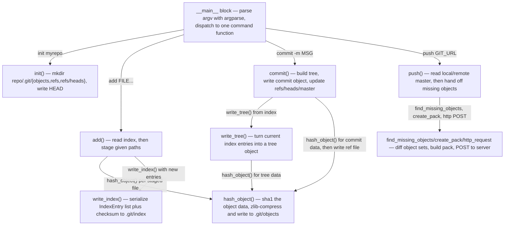

Run: pygit.py __main__ block, command sequence: init myrepo, then (in myrepo) add FILE..., commit -m MSG, push GIT_URL

| box id | label | where it lives | what it does |
|---|---|---|---|
| A | __main__ dispatch | pygit.py:498-591 | Builds argparse subcommands (add, cat-file, commit, diff, hash-object, init, ls-files, push, status) and calls the matching function on args.command |
| B | init() | pygit.py:40-47 | Creates repo dir, .git/objects, .git/refs, .git/refs/heads, and writes HEAD pointing at refs/heads/master |
| C | add() | pygit.py:249-265 | Reads current index, drops re-added paths, hashes each new path's contents as a blob, builds IndexEntry records, sorts and rewrites the index |
| D | hash_object() | pygit.py:50-62 | Computes the SHA-1 of "type size\0data", and if write=True zlib-compresses and stores it under .git/objects/xx/... |
| E | write_index() | pygit.py:231-246 | Packs IndexEntry tuples into the DIRC binary format plus trailing SHA-1 checksum and writes .git/index |
| F | commit() | pygit.py:289-318 | Calls write_tree(), reads parent from refs/heads/master, assembles commit text (tree/parent/author/committer/message), hashes it via hash_object(), and writes the new hash to refs/heads/master |
| G | write_tree() | pygit.py:268-277 | Reads index entries and concatenates "mode path\0sha1" for each into tree object bytes, passed to hash_object() |
| H | push() | pygit.py:471-495 | Resolves username/password, fetches remote and local master hashes, computes missing objects, prints status, then builds and POSTs the update |
| I | find_missing_objects / create_pack / http_request | pygit.py:401-411 (find_tree_objects), pygit.py:414-438 (find_commit_objects, find_missing_objects), pygit.py:441-468 (encode_pack_object, create_pack), pygit.py:349-358 (http_request) | Walks commit/tree history to find objects the remote lacks, encodes them into a PACK file, and sends it with basic-auth HTTP POST to {git_url}/git-receive-pack |

## Other entry points

- `cat-file` subcommand → cat_file() (pygit.py:99-126), which uses read_object()/find_object() and, for trees, read_tree()
- `diff` subcommand → diff() (pygit.py:210-228), built on get_status()
- `hash-object` subcommand → direct call to hash_object() from __main__ (pygit.py:579-581)
- `ls-files` subcommand → ls_files() (pygit.py:157-167)
- `status` subcommand → status() (pygit.py:193-207), built on get_status() (pygit.py:170-190)
- Importing pygit.py as a library (any function called directly without going through argparse/__main__)
