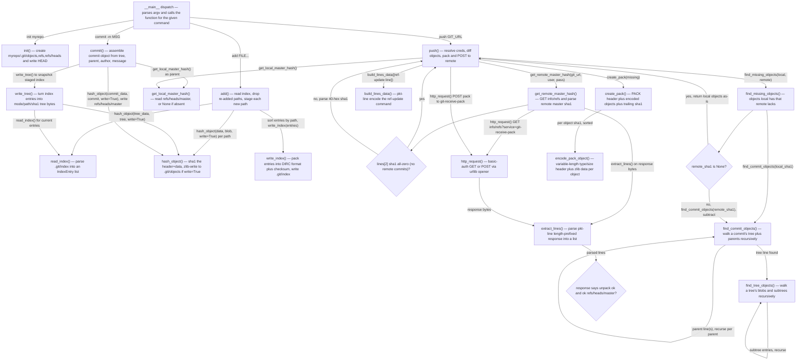

Run: pygit.py __main__ block, command sequence: init myrepo, then (in myrepo) add FILE..., commit -m MSG, push GIT_URL

| box id | label | where it lives | what it does |
|---|---|---|---|
| A | __main__ dispatch | pygit.py:566-591 | Reads args.command from argparse and calls add/commit/init/push (among others) with the parsed arguments |
| B | init() | pygit.py:40-47 | Creates repo dir, .git/objects, .git/refs, .git/refs/heads, and writes HEAD pointing at refs/heads/master |
| C | add() | pygit.py:249-265 | Reads current index, removes entries for re-added paths, hashes each new path as a blob, builds IndexEntry records, sorts, rewrites index |
| R | read_index() | pygit.py:129-154 | Reads .git/index, verifies the DIRC signature and trailing sha1 checksum, unpacks fixed fields plus path for each entry |
| D | hash_object() | pygit.py:50-62 | Builds "type size" header + NUL + data, sha1-hashes it, and if write=True zlib-compresses and stores it under .git/objects/xx/... |
| E | write_index() | pygit.py:231-246 | Packs IndexEntry tuples into the DIRC binary format plus trailing sha1 checksum and writes .git/index |
| F | commit() | pygit.py:289-318 | Calls write_tree(), reads parent via get_local_master_hash(), assembles commit text (tree/parent/author/committer/message), hashes it via hash_object(), writes the hash to refs/heads/master |
| G | write_tree() | pygit.py:268-277 | Reads index entries and concatenates "mode path\0sha1" for each into tree object bytes, passed to hash_object() |
| L | get_local_master_hash() | pygit.py:280-286 | Reads and strips .git/refs/heads/master, returning None if the file does not exist |
| H | push() | pygit.py:471-495 | Resolves username/password, fetches remote and local master hashes, computes missing objects, builds pkt-line ref-update plus pack, POSTs it, and validates the server's response |
| M | get_remote_master_hash() | pygit.py:361-375 | GETs {git_url}/info/refs?service=git-receive-pack, parses the pkt-line response for the remote's current master sha1 |
| M1 | no-remote-commits check | pygit.py:370-375 | Branches on whether the advertised sha1 is all zeros: returns None (no commits yet) or the parsed 40-hex sha1 |
| N | find_missing_objects() | pygit.py:430-438 | Computes the set of object hashes reachable from the local commit but not from the remote commit |
| N1 | remote_sha1 is None? | pygit.py:435-438 | If there is no remote commit yet, every local object is missing; otherwise subtracts the remote's reachable objects |
| K | find_commit_objects() | pygit.py:414-427 | Reads a commit object, adds its tree via find_tree_objects(), and recurses into each parent commit line |
| T | find_tree_objects() | pygit.py:401-411 | Reads a tree object and recurses into subtree entries, collecting every blob and subtree sha1 plus the tree's own sha1 |
| BD | build_lines_data() | pygit.py:338-346 | Encodes a list of byte lines into git's pkt-line wire format, ending with the "0000" flush packet |
| CP | create_pack() | pygit.py:459-468 | Writes a PACK header (signature, version, object count), encodes each object in sorted order, and appends a trailing sha1 |
| EP | encode_pack_object() | pygit.py:441-456 | Reads one object, encodes its type and size into pack's variable-length header, and zlib-compresses its data |
| P | http_request() | pygit.py:349-358 | Opens an authenticated (HTTP Basic) urllib request to the given URL, GET by default or POST when data is supplied |
| X | extract_lines() | pygit.py:321-335 | Walks a pkt-line byte string, reading each 4-hex-digit length prefix to split out individual lines |
| H1 | response validation | pygit.py:489-494 | Asserts the server replied with "unpack ok" and "ok refs/heads/master", signalling push success or raising an error |
