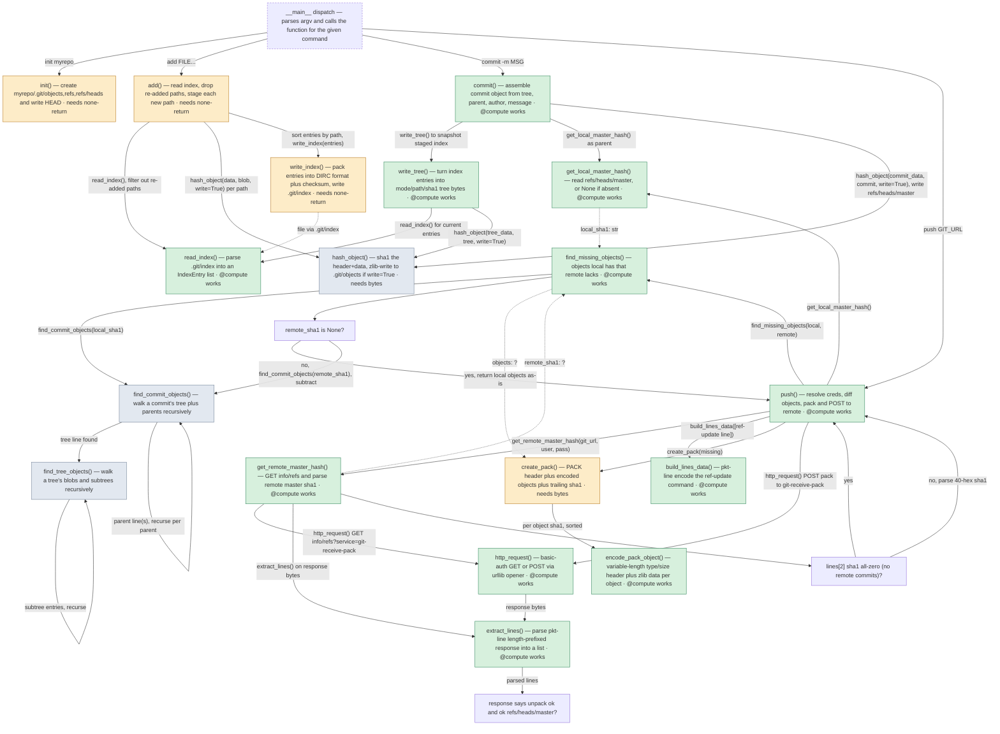

# CFG + data flow

*15 functions boxed, 20 computations, 8 components; 3 hand-offs unknown, 4 cross-checks to review.*

Path (from L1): pygit.py __main__ block, command sequence: init myrepo, then (in myrepo) add FILE..., commit -m MSG, push GIT_URL

Types: pyright 1.1.414 and the catalogue; environment: none needed (pygit uses only the standard library). Nothing was run.

## Annotated L2 diagram

Solid arrows are the CFG's own. Dashed arrows are hand-offs the data-flow report found that the CFG did not draw. Box colours: amber = a bare `@compute` raises here (the recipe is named), green = it works, grey = a loop body, not a node; dashed border = the box names no function the entry reaches.

## Boxes joined to functions

| box | label | function | data flow |
|---|---|---|---|
| A | __main__ dispatch — parses argv and calls the function for t | — | pygit.py:566 is at module level |
| B | init() — create myrepo/.git/objects,refs,refs/heads and writ | `init` | bare @compute raises; needs none-return; path parameters: repo |
| C | add() — read index, drop re-added paths, stage each new path | `add` | bare @compute raises; needs none-return |
| R | read_index() — parse .git/index into an IndexEntry list | `read_index` | — |
| D | hash_object() — sha1 the header+data, zlib-write to .git/obj | `hash_object` | loop body; bare @compute raises; needs bytes; receives, made inline by its caller: data: builtins.bytes |
| E | write_index() — pack entries into DIRC format plus checksum, | `write_index` | bare @compute raises; needs none-return |
| F | commit() — assemble commit object from tree, parent, author, | `commit` | — |
| G | write_tree() — turn index entries into mode/path/sha1 tree b | `write_tree` | — |
| L | get_local_master_hash() — read refs/heads/master, or None if | `get_local_master_hash` | — |
| H | push() — resolve creds, diff objects, pack and POST to remot | `push` | — |
| M | get_remote_master_hash() — GET info/refs and parse remote ma | `get_remote_master_hash` | — |
| M1 | lines[2] sha1 all-zero (no remote commits)? | `get_remote_master_hash` (inside) | see box M |
| N | find_missing_objects() — objects local has that remote lacks | `find_missing_objects` | — |
| N1 | remote_sha1 is None? | `find_missing_objects` (inside) | see box N |
| K | find_commit_objects() — walk a commit's tree plus parents re | `find_commit_objects` | loop body |
| T | find_tree_objects() — walk a tree's blobs and subtrees recur | `find_tree_objects` | loop body |
| BD | build_lines_data() — pkt-line encode the ref-update command | `build_lines_data` | — |
| CP | create_pack() — PACK header plus encoded objects plus traili | `create_pack` | bare @compute raises; needs bytes |
| EP | encode_pack_object() — variable-length type/size header plus | `encode_pack_object` | — |
| P | http_request() — basic-auth GET or POST via urllib opener | `http_request` | — |
| X | extract_lines() — parse pkt-line length-prefixed response in | `extract_lines` | — |
| H1 | response says unpack ok and ok refs/heads/master? | `push` (inside) | see box H |

## Cross-checks

- **No box for `write_file`**: the run calls it, the CFG didn't draw it. Review it as a candidate node.
- **No box for `read_tree`**: the run calls it, the CFG didn't draw it. Review it as a candidate node.
- **No box for `find_object`**: the run calls it, the CFG didn't draw it. Review it as a candidate node.
- **data is made inline in `commit`** and handed to `hash_object`: no function of its own produces it, so it is recorded only where a receiving node records it.
- **Unknown:** get_remote_master_hash → find_missing_objects (type unknown from the source). Auto assumes the recipe that doesn't depend on it; HITL may ask.
- **Unknown:** find_missing_objects → create_pack (type unknown from the source). Auto assumes the recipe that doesn't depend on it; HITL may ask.
- **Unknown:** http_request → extract_lines (type unknown from the source). Auto assumes the recipe that doesn't depend on it; HITL may ask.

## Not part of this run

- Box A is module-level code, the entry block: SDK start-up and export go here, not a node.
- Reached from the entry but not called on this run (other commands or entry points, uninstrumented as runs): `cat_file`, `diff`, `get_status`, `ls_files`, `status`.

## Prediction

- **Every box** (before step 3's filter; auto's selection is this minus what `mode2ideas.md` drops, and `--pick` gives its numbers): 15 functions, 20 computations counting call sites, 8 component(s) with builders at every ✗: get_local_master_hash, commit, get_remote_master_hash, find_missing_objects, encode_pack_object, create_pack | read_index, write_index | extract_lines, http_request | add | write_tree | build_lines_data | init | push
